<h1 align="center"> Design and fabrication of submarine for monitoring coral reefs</h1>

> *Abstract:*A simple submarine model for coral reef monitoring which is a manually operated vehicle and
uses three types of sensors for monitoring the water in the coral roof ecosystem is presented in this
paper. Coral reefs play a crucial role in the marine ecosystem by serving as a habitat for a wide range
of marine species and supporting the livelihoods of coastal communities. Nevertheless, these delicate
ecosystems are currently facing unparalleled challenges due to climate change, pollution, and human
activities. It is crucial to implement effective monitoring and conservation measures to ensure the
preservation of the health and diversity of coral reefs. The manually operated submarine with dpdt switches is capable of
navigating in the water, measuring and collecting data of TDS level of water, temperature of water and
pressure at the water various levels of water. For monitoring the collected data, we are using a Micro
SD card module to store the collected data so that we can observe the data after getting out the
submarine from water. Initially submarine is controlled using arduino uno and later on we replaced arduino uno with Raspberry pi 4.

<h2>Submarine</h2>

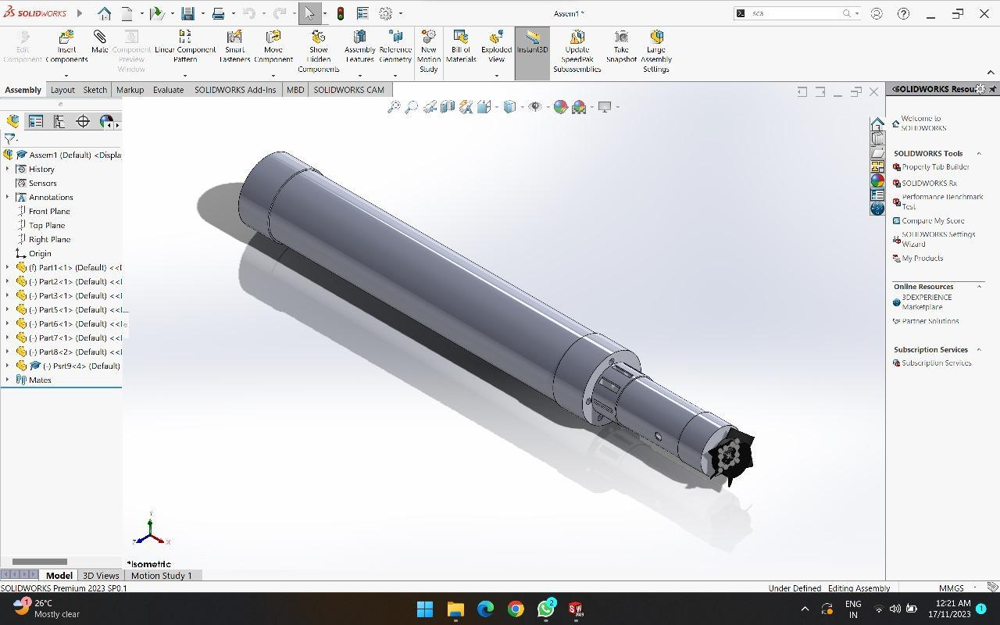

<h2>Components</h2>

<table>
  <tr >
    <td width=25%>  (a) </td>
    <td width=25%> 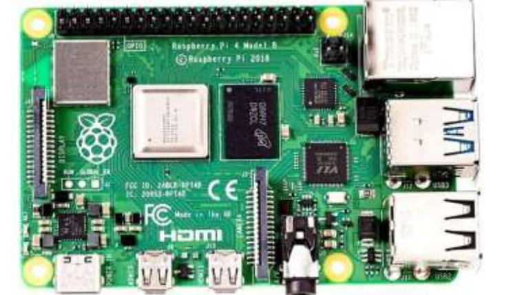 (b) </td>
    <td width=25%> 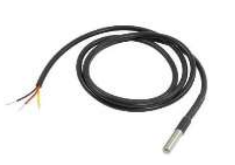 (c) </td>
    <td width=25%> 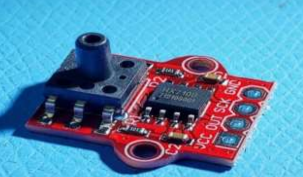 (d) </td>
  </tr>
  <tr>  
    <td width=25%>  (e) </td>
    <td width=25%>  (f) </td>
    <td width=25%>  (g) </td>
    <td width=25%>  (h) </td>
  </tr>
    <tr>  
    <td width=25%>  (i) </td>
    <td width=25%>  (j) </td>
    <td width=25%>  (k) </td>
    <td width=25%>  (l) </td>
  </tr>
</table>

(a) Ardunio Uno (1), (b) Raspberry pi-4 (1), (c) DS182B0 Temperature Sensor, (d) HX710B Pressure Sensor (1), (e)TDS Sensor, (f) Direct Current 555 gear Motor (2x), (g) Lithium Ion Cells (8x), (h) Limit Switch (2x), (i) Water Pump Motor(2x), (j) 0.5 m Power Sharing USB A to USB B Cable for Arduino UNO (1) (k) Syringes 50cc (12x),  Dpdt switches (2x) , (m) Acrylic sheets (2x), (n) Pvc pipe (2x), (o) coupler (2x) Threaded rods 3mm (3x), 

<h2>Overall Framework</h2>

<h3>1. Testing phase for sensors and implanting on ballast sysem</h3>
 

<table>
  <tr>
    <td width="30%"> 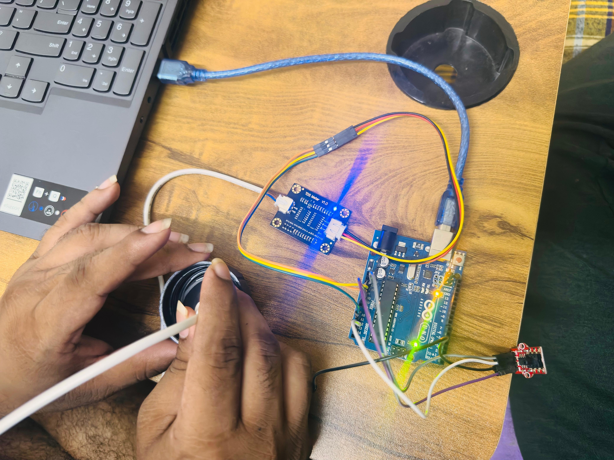 (a) </td>
    <td width="30%"> 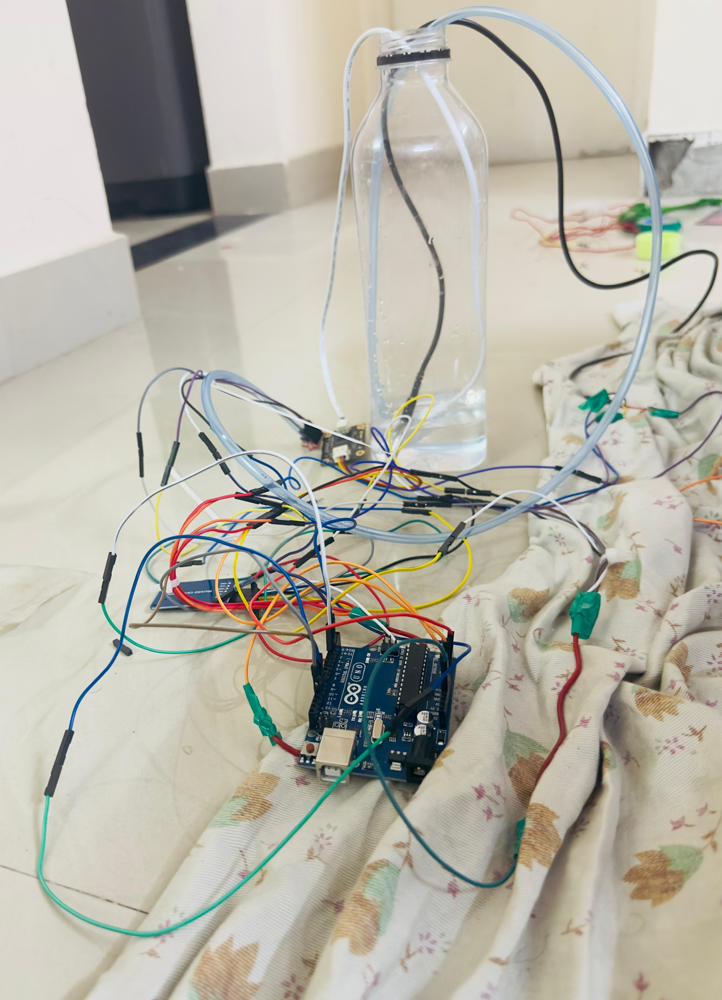 (b) </td>
    <td width="60%"> 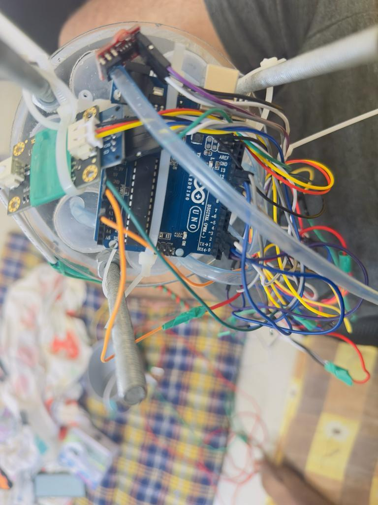 (c) </td>
  </tr>
</table>

(a), (b), (c) initial testing , 2nd stage testing, sensor arrangement on ballast system.

 

<h3>2. Circuit diagram for Raspberry pi-4</h3>

 

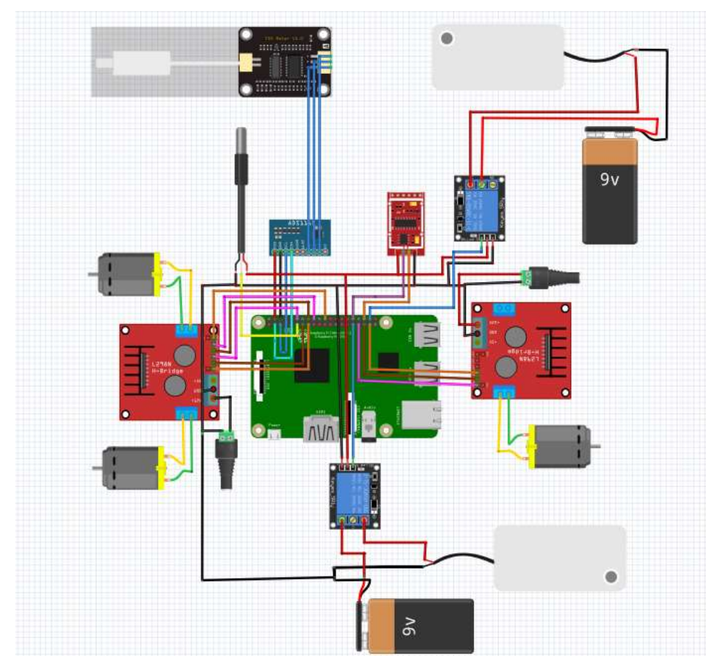

Circuit digram for raspberry pi-4 

<h3>3.Circuit diagram for Arduino uno </h3>
 

<table>
  <tr>
    <td width="50%"> 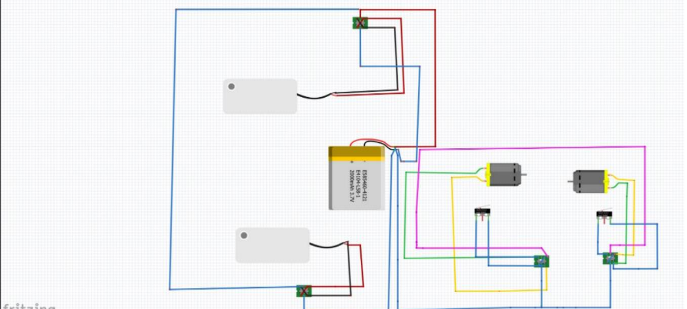 (a) </td>
    <td width="50%"> 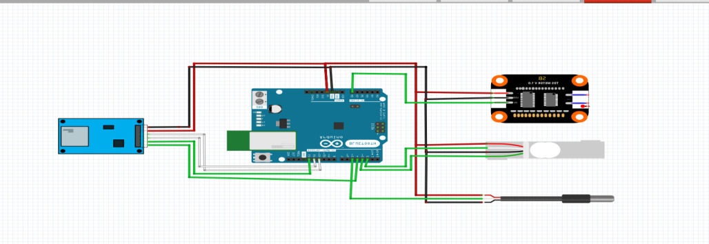 (b) </td>
  </tr>
</table>

(a), (b) Circuit diagram for motors (left) Circuit diagram for sensors (right).

 

<h3>2. Prototype Images</h3>

 

<table>
  <tr>
    <td width="30%"> 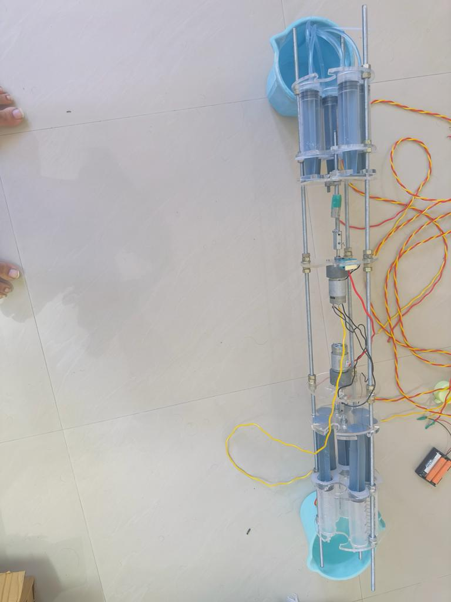 (a) </td>
    <td width="30%"> 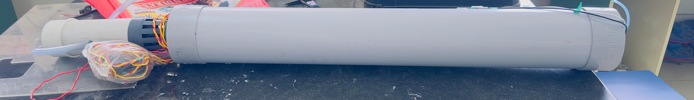 (b) </td>
     <td width="50%"> 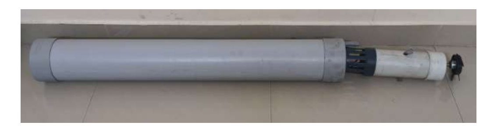 (c) </td>
  </tr>
</table>

(a), (b) , (c) Ballast System , subamarine output , Submarine output with propellor.

 

## Results
Pushing and sucking

This video demonstrates the pushing and suction mechanism of water!!

## Pushing the water
This video demonstrates the pushing mechanism of water!!

## suction of water
This video demonstrates the sucking mechanism of water!!

 

## Raspberyy pi setup
This video demonstrates the setup of raspberry-pi4 without monitor

  

## Quick Links:

## References Used:
- https://github.com/vinay-lanka/navbot_hardware
- https://github.com/leggedrobotics/darknet_ros
- https://github.com/ros-drivers/usb_cam

